<center><font size = 10 face = '黑体'>《MySQL存储引擎DBF定制开发》实验报告</font></center>

| 题目 | MySQL存储引擎定制开发 |
| :--: | --------------------- |

| 小组成员信息 |
| :----------: |

| 姓名   | 学号     | 班级     | 分工                                 |
| ------ | -------- | -------- | ------------------------------------ |
| 陈杰鹏 | 20337178 | 计科二班 | 数据查询、数据插入、表重命名、表删除 |
| 陈瀚翔 | 20337177 | 计科二班 | 数据更新、数据删除                   |

提交时间：	2022	年	12	月	30	日


# 一．开发环境与开发工具：

**开发环境:** Vmware Ubuntu 20.04

**开发工具:** MySQL-5.7.39 ， Clion 2022.3

# 二. 存储引擎功能需求分析

​		MySQL 是支持动态可插拔的储存引擎体系架构，从而可以创建新的储存引擎并直接将其添加到正在运行的 MySQL 中，而无需重新编译 MySQL。这种架构使得为 MySQL 开发新的储存引擎和部署变得更加容易。  
​		MySQL存储引擎是保存数据的核心技术，也就是说，存储引擎是服务于存储服务的，通过存储引擎将数据保存，MySQL的insert、delete等SQL语句，都是由存储引擎来完成结果生成的。  
​		MySQL服务器以模块化方式构建：存储引擎管理的数据存储和索引管理 MySQL。MySQL 服务器与存储引擎通信 通过定义的 API。每个存储引擎都是一个类，其中包含该类的每个实例 通过特殊接口与MySQL服务器通信。handler处理程序基于每个线程的一个处理程序进行实例化 这需要使用特定的表。例如：如果三个 所有连接都开始使用同一个表，三个处理程序 需要创建实例。创建处理程序实例后，MySQL 服务器会发出 处理程序的命令以执行数据存储和检索打开表、操作行和管理等任务 指标。自定义存储引擎可以循序渐进的方式构建：开发人员可以从只读存储引擎开始，然后添加支持和操作，甚至以后添加支持索引、事务和其他高级操作。  
​		同时MySQL也是引擎开发友好的，他为开发者提供了一个example的存储引擎模块，开发者只需要在example模块中基于自己的功能需求来实现即可。  
​		为了更好的将MySQL理论知识与实验相结合，我们决定基于example模块开发支持数据查询、数据插入、数据删除、数据更新的自制引擎，同时还应有表的重命名与删除功能。具体的四个阶段为：

- 生成引擎的方法存根——整个过程的第一步是创建一个可以被插入服务器的基本的存储引擎。创建最基本的源代码文件，为存储引擎从handler基类派生出一个子类，把这个存储引擎本身插入到服务器的源代码里。
- 实现表(文件)操作——能够正确的完成各种必要的文件操作，如创建、打开文件等。
- 实现数据读/写操作——利用MySQL提供的api接口，实现创建、查询功能。
- 实现数据更新和删除操作——实现对存储引擎里的数据进行修改的方法。

​		基于此实验，我们的知识将不再停留在对MySQL的SQL语句接口调用，而是深入到MySQL环境开发与功能设计，加深对MySQL的概念理解。

# 三. 存储引擎模块设计

## 初始化模块

**我们设计的引擎名为DBF，是以example模板为基础设计的。**

**handlerton**(handler singleton的缩写)定义了存储引擎，并包含那些适用于整个存储引擎的方法指针，而不是以每张表为单位的方法。这种方法的一些例子包括处理提交和回滚的事务方法。简单来说，handlerton类是所有存储引擎的标准接口，handerton结构是一个包含着许多数据项和方法的大型结构。

handlerton的参数可以参考表格：

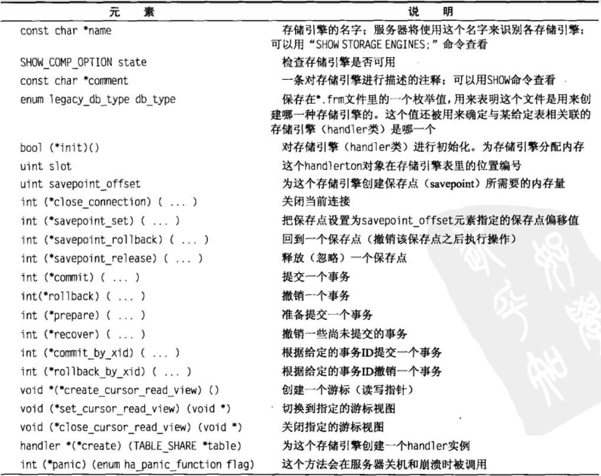

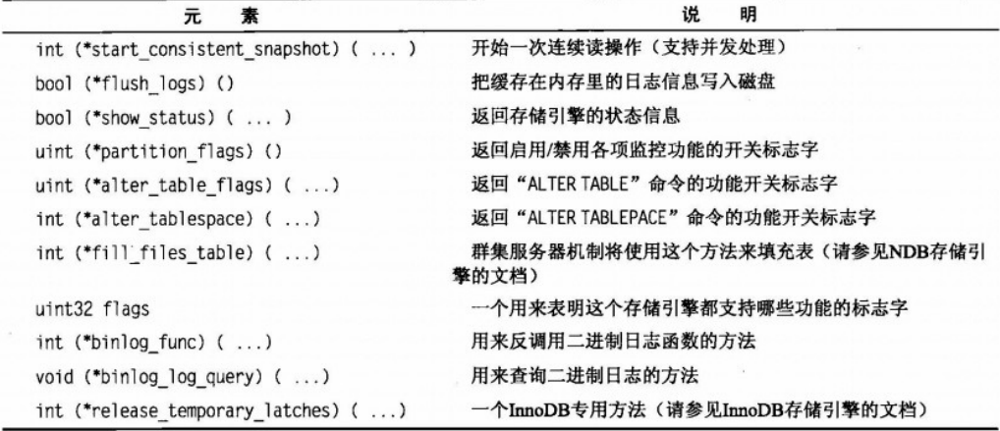

handlerton是mysql封装好供开发者使用的模块，在**ha_dbf.cc**中我们只需要创建一个handlerton类型指针，然后初始化需要的参数即可

```c++
handlerton *dbf_hton;
```

handler类是插件式存储引擎接口的另一个关键，它对存储引擎的接口部分作出了定义，并提供了一整套通过handlerton结构与服务器打交道的接口方法，与handlerton共同构成了存储引擎体系结构的抽象层。  

handler是example模块给出的:  

```c++
static handler *dbf_create_handler(handlerton *hton,
                                   TABLE_SHARE *table,
                                   MEM_ROOT *mem_root);

static handler *dbf_create_handler(handlerton *hton,
                                   TABLE_SHARE *table,
                                   MEM_ROOT *mem_root)
{
    return new (mem_root) ha_dbf(hton, table);
}
```

除了这些之外，我们还需要定义mysql所要求的PSI_MEMORY_KEY和PSI_MUTEX_KEY类型，一个是用来检测内存，一个是用来共享上锁，具体定义为：

```c++
static PSI_memory_key key_memory_dbf_share; //内存检测

static PSI_mutex_key key_mutex_dbf, key_mutex_Dbf_share_mutex; //两个锁，一个分配给dbf_mutex，一个分配给share->mutex

static PSI_mutex_info all_dbf_mutexes[]= //官方要求，要有info来注册
        {
                { &key_mutex_dbf, "dbf", PSI_FLAG_GLOBAL},
                { &key_mutex_Dbf_share_mutex, "Dbf_share::mutex", 0}
        };

static PSI_memory_info all_dbf_memory[]=//官方要求，要有info来注册
        {
                { &key_memory_dbf_share, "dbf_share", PSI_FLAG_GLOBAL}
        };

static void init_dbf_psi_keys(void)
{
    const char* category= "dbf";
    int count;
    count= array_elements(all_dbf_mutexes); //用array_elements 函数来数有多少条信息
    mysql_mutex_register(category, all_dbf_mutexes, count); //注册锁
    count= array_elements(all_dbf_memory); 
    mysql_memory_register(category, all_dbf_memory, count); //注册内存
}

```

在含有handlerton类，handler类和PSI类之后，就可以书写初始化函数dbf_init_func   

```c++
//dbf_get_key也是由example模块给出。在my_mutex_init中使用
static uchar* dbf_get_key(Dbf_share *share, size_t *length,
                          my_bool not_used MY_ATTRIBUTE((unused)))
{
    *length=share->table_name_length;
    return (uchar*) share->table_name;
}
static int dbf_init_func(void *p)
{
    DBUG_ENTER("dbf_init_func");
    //初始化PSI类型
    init_dbf_psi_keys();
    //初始化锁，将key_mutex_dbf赋给dbf_mutex
    mysql_mutex_init(key_mutex_dbf, &dbf_mutex, MY_MUTEX_INIT_FAST);
    //初始化哈希表
    (void) my_hash_init(&dbf_open_tables,system_charset_info,32,0,0,
                        (my_hash_get_key) dbf_get_key,0,0,
                        key_memory_dbf_share);

    dbf_hton = (handlerton *)p; //分配内存
    dbf_hton->state = SHOW_OPTION_YES; //show设置为可以
    dbf_hton->create = dbf_create_handler; // 这是handler类，具体是对dbf类进行创建。
    dbf_hton->flags = HTON_CAN_RECREATE; //可以创建多个
    dbf_hton->system_database = dbf_system_database; //指定数据库
    dbf_hton->is_supported_system_table = dbf_is_supported_system_table; //支持系统表操作
    DBUG_RETURN(0);
}
```

然后因为mysql是插件式存储引擎，我们要书写mysql_declare_plugin，模块由example给出，我们只需要更改为自己的参数

```c++
mysql_declare_plugin(dbf){
                                 MYSQL_STORAGE_ENGINE_PLUGIN,
                                 &dbf_storage_engine,
                                 "DBF",
                                 "Brian Aker, MySQL AB",
                                 "Dbf storage engine",
                                 PLUGIN_LICENSE_GPL,
                                 dbf_init_func, /* Plugin Init */
                                 NULL,          /* Plugin Deinit */
                                 0x0001 /* 0.1 */,
                                 func_status,          /* status variables */
                                 dbf_system_variables, /* system variables */
                                 NULL,                 /* config options */
                                 0,                    /* flags */
                         } mysql_declare_plugin_end;
```

接下来就是对处理程序进行实例化处理，首先给出定义的Dbf_share类和ha_dbf类的具体参数

```c++
class Dbf_share : public Handler_share {
public:
  char *table_name;//表名
  uint table_name_length,use_count; //表名长度 ， 使用次数
  mysql_mutex_t mutex; // 共享锁
  THR_LOCK lock; //锁
  bool crashed; //判断文件是否崩溃
  Dbf_share();
  ~Dbf_share()
  {
    thr_lock_delete(&lock);
  }
};

/** @brief
  Class definition for the storage engine
*/
class ha_dbf: public handler
{
  THR_LOCK_DATA lock;      ///< MySQL lock
  Dbf_share *share;    ///< Shared lock info
  off_t current_position;  /* Current position in the file during a file scan */
  File data_file; /* File handler for readers */
  int number_records; /* Number of records in the file */
  int number_del_records; /* Number of deleted records in the file */
  int header_size; /* Size of the header */
  int record_header_size; /* Size of the record header */
  bool crashed; /* Meta file is crashed */
  int write_header(); /* Write the header to the file */
  int read_header(); /* Read the header from the file */
  long long cur_position(); /* Get the current position in the file */
  int readrow(uchar *buf,int length,long long position); /* Read a row from the file */
public:
  .....
};
```

这里要用到header，是因为mysql以前有个问题就是创建文件是空的话，后面进行打开、写入等可能失败，所以干脆在一开始时把一些信息如crashed等写入文件中，之后读数据时现把header读掉，或者记录header的长度header_size，从header_size位置开始读。

初始化操作：

```c++
Dbf_share::Dbf_share()
{
    thr_lock_init(&lock);//初始化锁
}
ha_dbf::ha_dbf(handlerton *hton, TABLE_SHARE *table_arg)
        : handler(hton, table_arg),
          current_position(0), //当前位置
          data_file(-1),//数据文件，初始化为-1
          number_records(-1),//记录有多少条数据
          number_del_records(-1), //记录删除了多少条
          header_size(sizeof(bool)+sizeof(int)+sizeof(int)), //头部长度
          record_header_size(sizeof(uchar)+sizeof(int)) //记录头部的长度
{
}
```

接下来就是要定义表的扩展名，每个引擎对应着不同的后缀，这样才不会把别的引擎的表文件进行操作，因为我的引擎叫做DBF，所以我把文件的后缀命名为`.dbe`，而把索引（未实现）的后缀命名为`.dbi`。  

```c++
#define DBE_EXT ".dbe" // data file extension
#define DBI_EXT ".dbi" // index file extension
```

```c++
static const char *ha_dbf_exts[] = {
        DBE_EXT,//数据文件名
        DBI_EXT,//索引文件名
        NullS};

const char **ha_dbf::bas_ext() const
{
    return ha_dbf_exts; //返回ha_dbf_exts数组
}
```

最后，我们还需要了解的一个模块是共享模块**get_share**，这个方法负责为归档处理函数的所有实例创建一个共享结构，他在create、write_row等函数中都要用到，具体步骤是先用my_hash_search查找内存表中是否有一个Dbf_share类型的变量，若是还没有初始化过共享结构，那么就需要先对他进行内存分配创建并且对share的锁进行初始化，最终返回一个Dbf_share类型变量。

```c++
static Dbf_share *get_share(const char *table_name, TABLE *table)
{
    Dbf_share *tmp_share; //共享结构Dbf_share类
    char *tmp_name;
    uint length;
    length=(uint)strlen(table_name); //表名的长度
    DBUG_ENTER("ha_dbf::get_share()");
    mysql_mutex_lock(&dbf_mutex); //进行上锁
    /*
      If share is not present in the hash, create a new share and
      initialize its members.
    */
    //查找共享结构是否已经创建，用my_hash_search来查找，没创建的话要进行初始化创建
    if (!(tmp_share=(Dbf_share*)my_hash_search(&dbf_open_tables,
                                               (uchar*) table_name,
                                               length)))
    {
        //为tmp_share , tmp_name 分配长度为length+1的内存
        if (!my_multi_malloc(key_memory_dbf_share,
                             MYF(MY_WME | MY_ZEROFILL),
                             &tmp_share, sizeof(*tmp_share),
                             &tmp_name, length+1,
                             NullS))
        {
            //若分配失败，解锁并返回NULL
            mysql_mutex_unlock(&dbf_mutex);
            return NULL;
        }
        tmp_share->use_count=0; //使用次数
        tmp_share->table_name_length = length; //表名长度
        tmp_share->table_name=tmp_name; //表名
        strcpy(tmp_share->table_name, table_name);
        if (my_hash_insert(&dbf_open_tables, (uchar*) tmp_share)) //write a hash-key to the hash-index，要是失败则goto err
            goto err;
        thr_lock_init(&tmp_share->lock); //初始化tmp_share->lock
        mysql_mutex_init(key_mutex_Dbf_share_mutex,
                         &tmp_share->mutex, MY_MUTEX_INIT_FAST); //初始化tmp_share->mutex，赋成key_mutex_Dbf_share_mutex类型
    }
    tmp_share->use_count++;//使用次数+1
    mysql_mutex_unlock(&dbf_mutex);//解锁
    DBUG_RETURN(tmp_share);
    err:
    mysql_mutex_unlock(&dbf_mutex);
    if(tmp_share)
        my_free(tmp_share);
    DBUG_RETURN(NULL);
}
```

到此我们的准备工作已经完成，接下来开始进行表和数据的模块实现

## a. 表创建模块

表的创建需要定义的函数是`int ha_dbf::create(const char *name, TABLE *table_arg,HA_CREATE_INFO *create_info);`

具体步骤是先获得共享结构，然后用`fn_format`读取文件名，再用`my_open`来打开文件，存到data_file中，要是打开成功则读取文件的头部信息，然后写入文件的头部信息，最后关掉锁打开的文件。  

```c++
int ha_dbf::create(const char *name, TABLE *table_arg,
                   HA_CREATE_INFO *create_info)
{
    char name_buff[FN_REFLEN];
    DBUG_ENTER("ha_dbf::create");
    if(!(share=get_share(name,table))) //获得共享结构
        DBUG_RETURN(1);
    //用fn_format读取出文件名
    char *path = fn_format(name_buff,name,"",DBE_EXT,MY_REPLACE_EXT|MY_UNPACK_FILENAME); 
    //打开文件，使用api my_open 
    data_file = my_open(path, O_RDWR | O_CREAT | O_BINARY | O_SHARE, MYF(0));
    int flag = 0;
    //要是打开文件失败，那么flag置1
    if (data_file == -1)
        flag = 1;
    if(!flag) read_header(); //flag不为1，说明打开文件成功，读取文件头部信息
    number_records = 0;//初始化数量记录为0
    number_del_records = 0;//初始化删除数量记录为0
    crashed = false; //初始化崩溃参数为false
    write_header();//写入头部信息
    if(flag) DBUG_RETURN(-1); //要是flag=1，说明打开文件失败，返回-1
    if(data_file!=-1){ //要是有文件打开了，那么创建过程的最后要把他关闭掉。
        my_close(data_file,MYF(0));
        data_file = -1;
    }
    DBUG_RETURN(0);
}
```

这里有读取头部信息和写入头部信息的步骤，在上面也讲过是防止mysql出现创建空文件后后续无法读写的情况。read_header和write_header的实现如下：

```c++
int ha_dbf::read_header(){
    int len;
    DBUG_ENTER("ha_dbf::read_header");
    if(number_records==-1){//要是没被读过，也就是说当前是第一次读
        my_seek(data_file,0L,MY_SEEK_SET,MYF(0)); //从0开始寻找文件位置
        my_read(data_file,(uchar*)&crashed,sizeof(bool),MYF(0)); //将文件中的uchar读取到creashed
        my_read(data_file,(uchar*)&len,sizeof(int),MYF(0)); //将文件中的下一个uchar读取到len
        memcpy(&number_records,&len,sizeof(int)); //number_records赋值成len
        my_read(data_file,(uchar*)&len,sizeof(int),MYF(0)); // 将文件中的下一个uchar读取到len
        memcpy(&number_del_records,&len,sizeof(int));//number_del_records赋值成len
    }else{
        my_seek(data_file,header_size,MY_SEEK_SET,MYF(0)); //否则只是定位文件，跳过头部信息，从header_size开始
    }
    DBUG_RETURN(0);
}
```

```c++
int ha_dbf::write_header(){
    DBUG_ENTER("ha_dbf::write_header");
    if(number_records!=-1){ //要是没被写过，也就是说当前是第一次写
        my_seek(data_file,0l,MY_SEEK_SET,MYF(0));//从0开始寻找文件位置
        my_write(data_file,(uchar*)&crashed,sizeof(bool),MYF(0)); //向文件写入creashed
        my_write(data_file,(uchar*)&number_records,sizeof(int),MYF(0)); //向文件写入number_records
        my_write(data_file,(uchar*)&number_del_records,sizeof(int),MYF(0)); //向文件写入number_del_records
    }
    DBUG_RETURN(0);
}
```

除了create函数之外，我们还要有open函数来打开文件，open会在读和写函数之前自动调用，函数声明为`int ha_dbf::open(const char *name, int mode, uint test_if_locked);`，函数定义与create函数基本类似，都是先获得共享结构，然后用`fn_format`读取文件名，再用`my_open`来打开文件，存到data_file中，要是打开成功则读取文件的头部信息，最后初始化锁share-lock。

```c++
int ha_dbf::open(const char *name, int mode, uint test_if_locked)
{
    DBUG_ENTER("ha_dbf::open");
    char name_buff[FN_REFLEN];
    if(!(share = get_share(name,table)))//获得共享结构
        DBUG_RETURN(1);
    char *path = fn_format(name_buff,name,"",DBE_EXT,MY_REPLACE_EXT|MY_UNPACK_FILENAME); //获得文件名
    data_file = my_open(path, O_RDWR | O_CREAT | O_BINARY | O_SHARE, MYF(0));//打开文件
    int flag = 0;
    if (data_file == -1)
        flag = 1;
    if(!flag){
        read_header(); //若打开文件成功，则读取文件头部信息
    }
    //初始化锁
    thr_lock_data_init(&share->lock, &lock, NULL);

    DBUG_RETURN(0);
}
```

## b. 数据查询模块

查询模块是语句select来触发，select的步骤在example中也有介绍，如图  

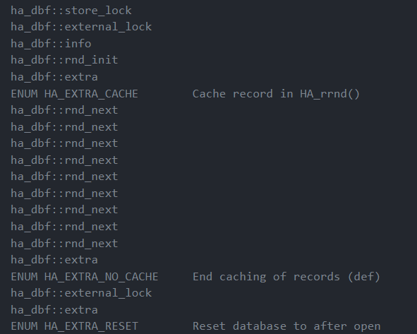

其中info , rnd_init , rnd_next是需要我们实现的，其他都有example模块给出了；除图中所述的之外还有position函数。  

首先是rnd_init函数，该函数是为全表扫描操作设置初始条件，具体需要把位置参数current_position设置为0，handler类里的记录个数stats.records设置为0，然后把数据项长度ref_length设置成sizeof(long long),用于后续比较写入数据的大小。 

```c++
int ha_dbf::rnd_init(bool scan)
{
    DBUG_ENTER("ha_dbf::rnd_init");
    current_position=0;//当前位置
    stats.records= 0; //handler类中的记录个数变量
    ref_length = sizeof(long long); //数据项长度
    DBUG_RETURN(0);
}
```

接下来就是rnd_next函数，它不仅负责从磁盘读入数据，还负责检查是否已经到达文件尾。具体步骤是先告诉系统进行读取rnd_next的计数统计，然后开始定位文件位置，若定位到文件的话则读出头部信息，然后根据buf长度来读出数据，否则判断是否需要将读取位置变成当前位置机上数据长度再加上头部长度，再次进行数据读取；要是数据读取成功，则当前位置变量current_position还要进行更新。  

代码如下：

```c++
int ha_dbf::rnd_next(uchar *buf)
{
    int rc=-1;
    DBUG_ENTER("ha_dbf::rnd_next");
    ha_statistic_increment(&SSV::ha_read_rnd_next_count);//这条是用来进行统计分析rnd_next_count
    // buf table->s->rec_buff_length current_position
    rc = readrow(buf, table->s->rec_buff_length,current_position); //调用readrow进行数据读取
    if(rc!=-1) current_position = (off_t)cur_position(); //要是数据读取成功，那么调用cur_position给当前current_position进行更新
    else DBUG_RETURN(HA_ERR_END_OF_FILE);//否则，返回已经到文件末尾。
    stats.records++;//记录个数加1
    DBUG_RETURN(0);
}
```

readrow做的工作是开始定位文件位置，若定位到文件的话则读出头部信息，然后根据buf长度来读出数据，否则判断是否需要将读取位置变成当前位置机上数据长度再加上头部长度，再次进行数据读取

```c++
int ha_dbf::readrow(uchar *buf,int length,long long position){
    int i;
    int rec_len;
    long long pos;
    uchar deleted = 2;
    DBUG_ENTER("ha_dbf::read_row");
    if(position<=0) position = header_size;
    pos = my_seek(data_file, position, MY_SEEK_SET, MYF(0)); //从当前position定位文件
    if(pos != -1L ){//定位到文件
        i = my_read(data_file, &deleted, sizeof(uchar), MYF(0)); //读出uchar数据到deleted
        if(deleted == 0){//要是delted为0证明读取成功
            i = my_read(data_file,(uchar*)&rec_len,sizeof(int),MYF(0));//读出uchar数据到rec_len变量
            i = my_read(data_file, buf , (length < rec_len)?length:rec_len, MYF(0)); //将rec_len和length进行比较，选择较小的一个进行buf数据读取
        }else if (i == 0){
            DBUG_RETURN(-1);
        }else {//否则，读取位置变成当前位置加上数据长度再加上头部长度，再次进行读取。
            DBUG_RETURN(readrow(buf,length,cur_position()+length+(record_header_size-sizeof(uchar))));
        }
    }else DBUG_RETURN(-1);
    DBUG_RETURN(0);
}
```

cur_position的工作是重新定义文件位置

```c++
long long ha_dbf::cur_position(){
    long long pos;
    DBUG_ENTER("ha_dbf::cur_position");
    pos = my_seek(data_file,0L,MY_SEEK_CUR,MYF(0));//从0开始寻找文件位置
    if(pos==0){
        DBUG_RETURN(header_size); //跳过头部信息部分
    }
    DBUG_RETURN(pos);
}
```

接下来要修改position函数，它负责把文件的当前读写位置记录到MySQL的指针存储机制里。每个rnd_next函数调用的后面都有position调用，position里调用my_store_ptr来保存这些指针，需要输入三个参数：一个引用变量表示存放的位置，一个变量表示存放的数据长度，还有一个变量表示存放的数据。

```c++
void ha_dbf::position(const uchar *record)
{
    DBUG_ENTER("ha_dbf::position");
    my_store_ptr(ref, ref_length, current_position);//存放指针
    DBUG_VOID_RETURN;
}
```

rnd_pos用来检索被保存起来的当前位置并从哪个位置读入一个行，与position的my_store_ptr对应，rnd_pos中引用了my_get_ptr来获得指针。  

```c++
int ha_dbf::rnd_pos(uchar *buf, uchar *pos)
{
    DBUG_ENTER("ha_dbf::rnd_pos");
    ha_statistic_increment(&SSV::ha_read_rnd_next_count);//先进行系统统计
    current_position= (off_t)my_get_ptr(pos,ref_length);//引用变量和检索长度
    //buf , current_position , -1
    readrow(buf, current_position, -1);//再进行数据读取
    DBUG_RETURN(0);
}
```

info 向优化器返回信息，让优化器可以选择一个最优的执行路径。返回的是handler类里的stats.records记录个数变量，但是该优化器更倾向于获得一个大于等于2的数，所以我们要将小于2时的stats.records记录为2  

```c++
int ha_dbf::info(uint flag)
{
    DBUG_ENTER("ha_dbf::info");
    if(stats.records<2) stats.records=2;//欺骗优化器
    DBUG_RETURN(0);
}
```

## c. 数据插入模块

数据插入模块是由函数write_row来实现，函数声明为`int ha_dbf::write_row(uchar *buf);`，函数定义为上锁，先让系统对write进行操作次数统计，然后定位文件位置，定位成功后先写入头部信息如deleted和len，再写入数据信息，最后记录数加1，解锁。

```c++
int ha_dbf::write_row(uchar *buf)
{
    DBUG_ENTER("ha_dbf::write_row");
    /*
      Dbf of a successful write_row. We don't store the data
      anywhere; they are thrown away. A real implementation will
      probably need to do something with 'buf'. We report a success
      here, to pretend that the insert was successful.
    */
    ha_statistic_increment(&SSV::ha_write_count);//进行write的系统统计
    mysql_mutex_lock(&dbf_mutex);//上锁
    // buf , table->s->rec_buff_length
    int length = table->s->rec_buff_length; //获取数据项buf的长度
    long long pos;
    int i;
    int len;
    uchar deleted = 0;
    pos = my_seek(data_file, 0L, MY_SEEK_END, MYF(0)); //定位文件位置
    //先书写头部信息
    i = my_write(data_file, &deleted, sizeof(uchar), MYF(0)); //先写入deleted变量，用于readrow函数
    memcpy(&len,&length,sizeof(int)); //len赋值成length
    i = my_write(data_file, (uchar*)&len,sizeof(int),MYF(0)); //在写入len长度
    //再书写数据
    i = my_write(data_file, buf, length, MYF(0));
    if(i==-1) pos = i;
    else number_records++; //写成功，记录数加1
    if(pos){}
    mysql_mutex_unlock(&dbf_mutex);//解锁
    DBUG_RETURN(0);
}
```

## d. 数据删除模块

数据插入模块是由函数`delete_row`来实现，函数声明为`int ha_dbf::delete_row(const uchar *old_rec);`，实现方式为先上锁，然后找到目标记录位置，如果位置未知，通过一次读取一行来扫描记录，直到找到为止；如果位置已知，则删除行，删除记录数+1，记录数-1，最后解锁。

```c++
int ha_dbf::delete_row(const uchar *old_rec)
{
    long long position;
    int length = table->s->rec_buff_length;
    int i =-1;
    long long pos;
    long long cur_pos;
    uchar *cmp_rec;
    uchar delected = 1;

    DBUG_ENTER("ha_dbf::delete_row");
    if(current_position>0)
        position = current_position - (length + record_header_size);
    else
        position=0;
    mysql_mutex_lock(&dbf_mutex);

    if(position == 0)
        position = header_size; //move past header
    pos=position;
    /*
     * 如果位置未知，通过一次读取一行来扫描记录，直到找到为止。
    */
    if(position==-1) //如果位置未知的情况
    {
        cmp_rec = (uchar *) my_malloc(key_memory_dbf_share, length, MYF(MY_ZEROFILL | MY_WME));
        pos = 0;

        /*
         * Note: my_seek() 返回位置，若出错返回-1
        */
        cur_pos = my_seek(data_file, header_size, MY_SEEK_SET, MYF(0));
        /*
         * Note: read_row() return 返回当前文件指针
         */
        while ((cur_pos != -1) && (pos != -1))
        {
            pos = readrow(cmp_rec, length, cur_pos);
            if (memcmp(old_rec, cmp_rec, length) == 0)
            {
                number_records--;
                number_del_records++;
                pos=cur_pos;
                cur_pos=-1;
            }
            else if (pos != -1)   //移动到下条记录前
            {
                cur_pos = cur_pos + length + record_header_size;
            }
            my_free(cmp_rec);
        }
    }
    /*
     * 位置已知，修改行
     */
    if(pos!=-1) {
        /*
         * 写入删除的字节、行的长度和当前文件指针处的数据。
         */
        pos=my_seek(data_file, pos, MY_SEEK_SET, MYF(0));
        i = my_write(data_file, &delected, sizeof(uchar), MYF(0));
        i=(i>1)?0:i;
    }

    mysql_mutex_unlock(&dbf_mutex);
    DBUG_RETURN(0);
}
```

`delete_all_row`函数对应删除所有行情况：

```c++
int ha_dbf::delete_all_rows()
{
    DBUG_ENTER("ha_dbf::delete_all_rows");
    mysql_mutex_lock(&dbf_mutex);
    if(data_file!=-1)
    {
        my_chsize(data_file,0,0, MYF(MY_WME));
        write_header();
    }
    mysql_mutex_unlock(&dbf_mutex);
    DBUG_RETURN(0);
}
```


## e. 数据更新模块

数据插入模块是由函数`update_row`来实现，函数声明为`int ha_dbf::update_row(const uchar *old_rec);`，实现方式为先上锁，然后找到目标记录位置，如果位置未知，通过一次读取一行来扫描记录，直到找到为止；如果位置已知，则对记录进行修改，最后解锁。

```c++
int ha_dbf::update_row(const uchar *old_rec, uchar *new_rec)
{

    DBUG_ENTER("ha_dbf::update_row");
    mysql_mutex_lock(&dbf_mutex);
    int length=table->s->rec_buff_length;
    longlong position =current_position-(length+record_header_size);
    longlong  pos;
    longlong cur_pos;
    uchar *cmp_rec;
    int len;
    uchar deleted=0;
    int i=-1;
    if(position==0)
        position=header_size; //移动 header
    pos=position;
    /*
        如果位置未知，通过一次读取一行来扫描记录，直到找到为止。
    */
    if(position==-1) //如果位置未知的情况
    {
        cmp_rec = (uchar *) my_malloc(key_memory_dbf_share, length, MYF(MY_ZEROFILL | MY_WME));
        pos = 0;

        /*
         * Note: my_seek() 返回记录位置，出错返回-1
        */
        cur_pos = my_seek(data_file, header_size, MY_SEEK_SET, MYF(0));
        /*
         * Note: read_row() 返回当前文件指针，若出错返回-1
         */
        while ((cur_pos != -1) && (pos != -1)) {
            pos = readrow(cmp_rec, length, cur_pos);
            if (memcmp(old_rec, cmp_rec, length) == 0) {
                pos = cur_pos;    //找到位置
                cur_pos = -1;     //停止循环
            } else if (pos != -1)   //移动到下条记录前
            {
                cur_pos = cur_pos + length + record_header_size;
            }
            my_free(cmp_rec);
        }
    }
    /*
     * 位置已知，修改行
     */
    if(pos!=-1)
    {
        /*
         * 写入删除的字节、行的长度和当前文件指针处的数据。
         */
        my_seek(data_file,pos,MY_SEEK_SET,MYF(0));
        i = my_write(data_file,&deleted,sizeof(uchar), MYF(0));
        memcpy(&len,&length,sizeof(int));
        i = my_write(data_file,(uchar*)&len,sizeof(int),MYF(0));
        pos = i;
        i = my_write(data_file, new_rec,length, MYF(0));
    }
    mysql_mutex_unlock(&dbf_mutex);
    DBUG_RETURN(0);
}

```


## f. 表重命名模块

表的重命名由函数rename_table来实现，存储引擎会把文件复制到一个新的名字并删除旧文件，.frm文件的重命名则是由mysql服务器来完成，我们要删除的是.dbe文件，但是要注意的是新文件的数据复制工作也要由我们来完成，因此rename的函数声明是`int ha_dbf::rename_table(const char *from, const char *to);`，函数定义是先获得共享结构，上锁，把要删除的表文件先关闭掉，然后调用api`my_copy`将文件数据复制到新的文件里，在打开新文件读取新文件的头部信息，最后解锁并且删除掉旧文件。

```c++
int ha_dbf::rename_table(const char *from, const char *to)
{
    DBUG_ENTER("ha_dbf::rename_table ");
    char data_from[FN_REFLEN];
    char data_to[FN_REFLEN];
    if(!(share=get_share(from,table)))//获得共享结构
        DBUG_RETURN(1);
    mysql_mutex_lock(&dbf_mutex);//上锁
    if(data_file!=-1){
        my_close(data_file,MYF(0)); //先关文件
        data_file=-1;
    }
    //对文件数据进行复制，调用api my_copy
    my_copy(fn_format(data_from, from, "", DBE_EXT, MY_REPLACE_EXT | MY_UNPACK_FILENAME), 
            fn_format(data_to, to, "", DBE_EXT, MY_REPLACE_EXT | MY_UNPACK_FILENAME),
            MYF(0));
    int flag = 0;
    //打开新文件
    data_file = my_open(data_to, O_RDWR | O_CREAT | O_BINARY | O_SHARE, MYF(0));
    if(data_file==-1){
        flag = 1;
    }
    //读取新文件的头部信息
    if(!flag){
        read_header();
    }
    mysql_mutex_unlock(&dbf_mutex);//解锁
    my_delete(data_from,MYF(0));//删除掉旧文件
    DBUG_RETURN(0);
}
```

## g. 表删除模块

表的删除由delete_table来完成，函数声明为`int ha_dbf::delete_table(const char *name);`，函数定义为先获得共享结构，设置锁，然后把要删除的文件先关闭掉，获得文件名后再调用api`my_delete`来删除文件，最后解锁。

```c++
int ha_dbf::delete_table(const char *name)
{
    DBUG_ENTER("ha_dbf::delete_table");
    /* This is not implemented but we want someone to be able that it works. */
    char name_buff[FN_REFLEN];
    if(!(share=get_share(name,table)))//获得共享结构
        DBUG_RETURN(1);
    mysql_mutex_lock(&dbf_mutex);//设置锁
    if(data_file!=-1){
        my_close(data_file,MYF(0));//先把文件关了
        data_file=-1;
    }
    char*path = fn_format(name_buff, name, "", DBE_EXT, MY_REPLACE_EXT | MY_UNPACK_FILENAME);//获得文件名
    my_delete(path,MYF(0));//调用api删除文件
    mysql_mutex_unlock(&dbf_mutex);//解锁
    DBUG_RETURN(0);
}
```


# 四. 存储引擎功能测试

## 1. 存储引擎的加载

### mysql-5.7.39源码下载

先在https://downloads.mysql.com/archives/community/下载对应的MySQL源码(也可以下载我们的mysql-5.7.39压缩包，这样可以直接跳到clion下载和配置)

+++

> Product Version : 5.7.39
>
> Operating System : Source Code
>
> OS Version : All Operating Systems (Generic) (Architecture Independent)
>
> +++

因为MySQL必须要有boost库，下方链接选的是Compress TAR Archive , Includes Boost Headers 。

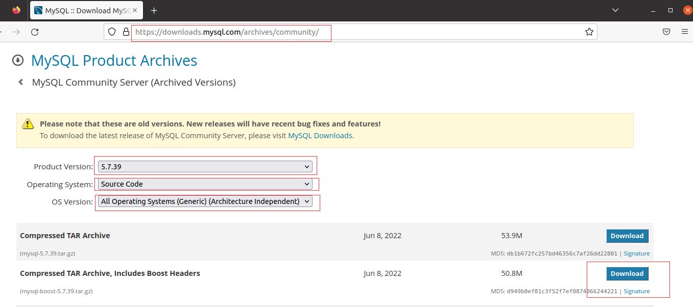

下载完成后，mysql-boost-5.7.39.tar.gz解压到你选定的文件夹下，指定指令为`tar -xvzf mysql-boost-5.7.39.tar.gz`  

解压完成后会得到名为`mysql-5.7.39`的文件夹，接下来的操作是，因为我们想要方便访问自己的数据库，所以我们要指定data的存放路径datadir，同时为了不破坏mysql-5.7.39的原生文件夹，我们决定用名为build_out的文件夹来存放cmake生成的文件，具体操作：

- 在mysql-5.7.39目录下打开终端
- 执行`mkdir build_out`
- `cd build_out`
- `mkdir data`

接下来就是对我们的存储引擎文件夹的创建，我们来到mysql-5.7.39/storage文件夹，在里面创建一个名为**dbf**的文件夹`mkdir dbf`，然后把我们的`ha_dbf.h`、`ha_dbf.cc`、`CMakeLists.txt`放进去。

最后是对依赖库的安装，在实验中大概需要用到以下库(Vmware Ubuntu下的安装命令)：

+++

> sudo apt-get install make 
> sudo apt-get install gcc 
> sudo apt-get install g++
> sudo apt-get install cmake
> sudo apt-get install openssl
> sudo apt-get install libssl-dev
> sudo apt-get install libncurses5-dev 
> sudo apt-get install bison
>
> +++

### clion下载和配置

到这里mysql-5.7.39的源码下载、文件夹创建以及所需要的库的安装工作已经完成，接下来是对clion的配置,首先说一下为什么需要用到clion，一开始项目是在mysql/5.7.39/build_out/bin中运行`./mysqld`和`./mysql`来测试的，但是这样运行mysqld，在实现了查询功能之后，mysqld会自动崩溃，而使用clion则没有这种情况。

- 在Vmware Ubuntu中，可以用snap install来下载clion，执行命令为`sudo snap install clion --classic`  

- 安装完成后在终端输入`clion`，即可启动clion，接下来是你的用户登录步骤，此步骤忽略  

- 接下来打开你的mysql-5.7.39文件夹，然后会弹出一个cmake界面，更新的内容如下

  +++

  > Generator : Unix Makefiles
  >
  > CMake options :
  >
  > . -DWITH_DEBUG=1 -DWITH_DBF_STORAGE_ENGINE=1  -DDOWNLOAD_BOOST=1 -DWITH_BOOST=./boost -DCMAKE_INSTALL_PREFIX=build_out -DMYSQL_DATADIR=build_out/data 
  >
  > +++

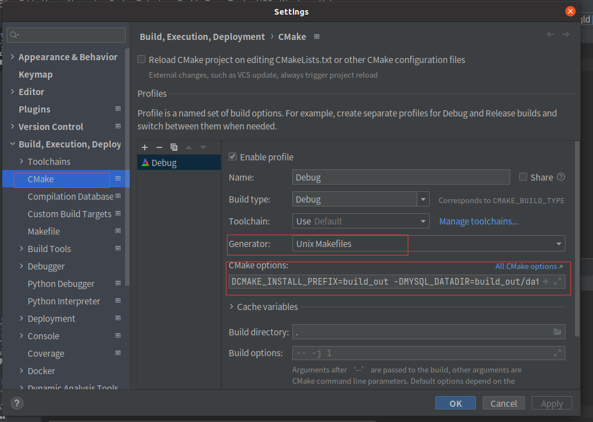

​		设置完成后点击apply，这时候就会开始cmake过程。若出现链接库缺失的情况，请根据提示下载对应的链接库。  

- 在cmake完成后，在clion的终端窗口输入`make && make install`
  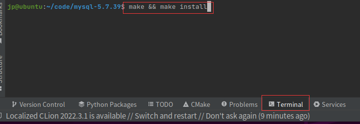

​		make的过程比较久，make install也有可能需要管理员权限，若提示则换成`sudo make install `

- 接下来我们要配置my.cnf文件，`ctrl+alt+T`进入终端，`sudo -i`进入权限模式 ，然后`vim /etc/my.cnf`用vim打开my.cnf文件，输入如下:

  +++

  >[mysqld]
  >datadir=/home/jp/code/mysql-5.7.39/build_out/data
  >lc-messages-dir=/home/jp/code/mysql-5.7.39/build_out/share
  >character-set-server=utf8mb4
  >collation-server=utf8mb4_bin
  >
  >[client]
  >default-character-set=utf8mb4
  >
  >[mysql]
  >default-character-set=utf8mb4
  >
  >+++

  datadir和lc-messages-dir都需要根据你的mysql-5.7.39的路径来指定。在vim中`insert`键是开始写入，然后ESC，输入`:wq`是保存并退出

  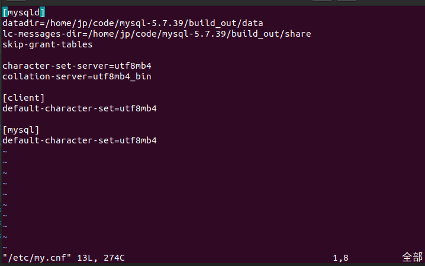

- 接下来就是mysqld初始化用户并获得初始化密码，在mysql-5.7.39/build_out/bin下输入`./mysqld --initialize --user=root`，user可以为你指定，运行成功的话最后一行会返回一个初始密码，一开始需要用这个密码来登录，后续需要自己更改；如果为了测试方便的话，可以像我一样在my.cnf中加入`skip-grant-tables`，这样就不需要用户登录了。

- 初始化之后我们开始运行mysqld，在clion右上方有一个debug的选项，点击一下，然后点击里面的`Edit configurations`
  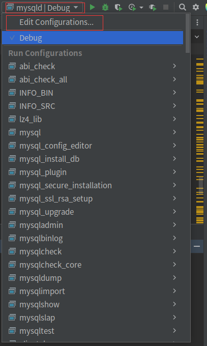

​		然后输入`mysqld`，找到mysqld，在Program Arguements一行输入`--defaults-file=/etc/my.cnf --debug=d,info:F:L`	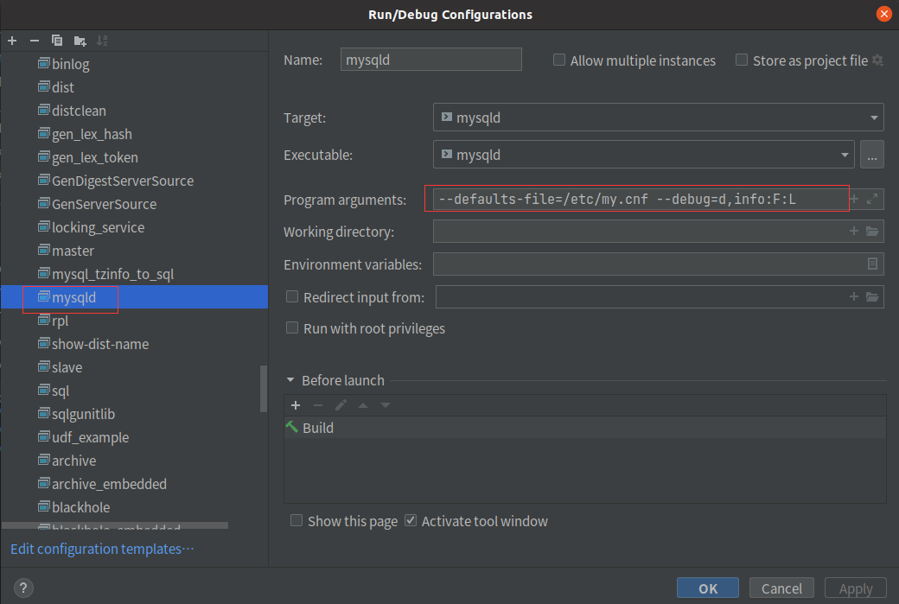

​		完成后点击应用，最后点击右上方的debug三角，即可运行mysqld

​		运行成功的画面如下：

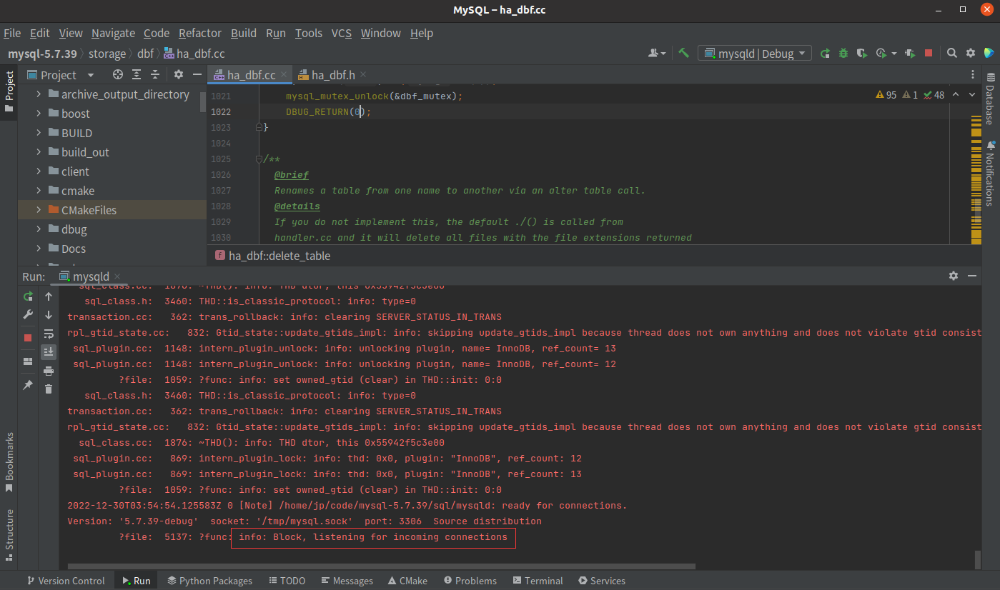

对于数据库的连接，我们可以选择mysql-5.7.39/build_out/bin里的mysql，运行`./mysql` ，也可以选择远程连接数据库，但是需要关闭掉虚拟机的防火墙，关闭命令为:

+++

>1:查看防火状态systemctl status firewalld
>
>service  iptables status
>
>2:暂时关闭防火墙
>
>systemctl stop firewalld
>
>service  iptables stop
>
>3:永久关闭防火墙
>
>systemctl disable firewalld
>
>chkconfig iptables off
>
>4:重启防火墙
>
>systemctl enable firewalld
>
>service iptables restart 
>
>+++

关闭后在在远程的Workbench，输入虚拟机对应的ip，端口为3306，然后输入root和密码进行连接。

## 2. 表的创建

在第一步开启了mysqld之后，我们在mysql-5.7.39/build_out/bin中运行`./mysql`，即可进入数据库。  

数据库的信息是存放在mysql-5.7.39/build_out/data里面的，我们先查看里面是否有数据库  

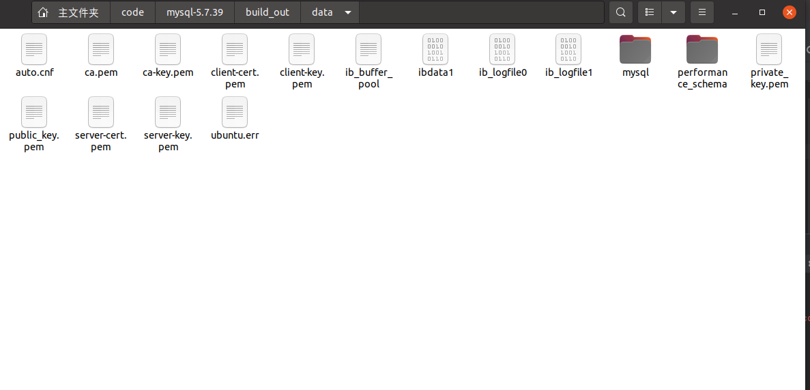

然后在mysql-5.7.39/build_out/bin中运行`./mysql`，即可连接：

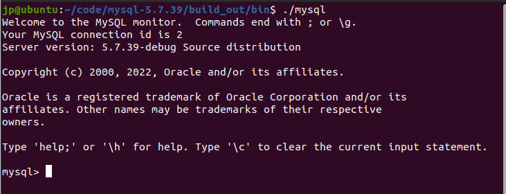

接下来我们创建一个名为`jxgl`的数据库，我们先输入`use jxgl`，确保jxgl数据库还没被创建。  

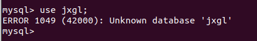

然后我们创建jxgl数据库`create database jxgl;`

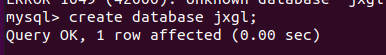

这时候再查看mysql-5.7.39/build_out/data，会看到多生成了一个名为jxgl的文件夹，这就是我们新建的数据库。

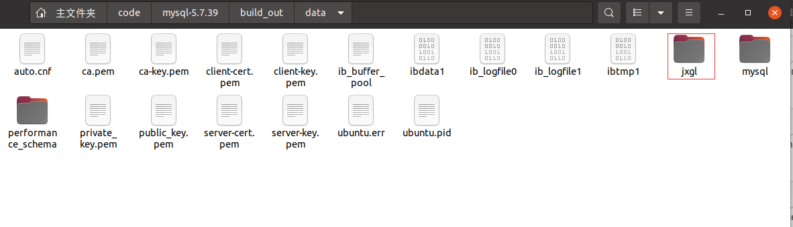

查看jxgl，只有一个.opt文件

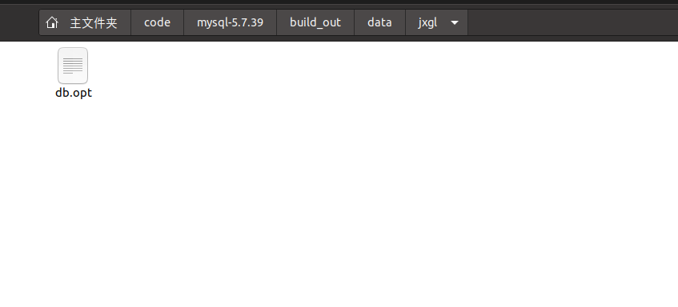

接下来进行表的创建，命令为

```sql
use jxgl;
create table sc(id int,name char(7),age int)engine=dbf;
```

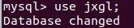

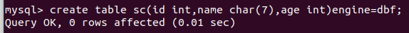

创建成功，再查看一下jxgl文件夹  

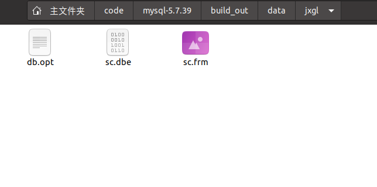

生成了sc.dbe文件，.dbe是dbf引擎中命名的文件后缀。

## 3. 数据插入

用2.表的创建中创建的`sc(id int,name text,age int)engine=dbf`来进行插入，首先查看一下当前表中信息：  

```sql
select * from sc;
```

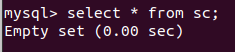

接下来进行插入操作，首先尝试单条插入  

```sql
insert into sc values(1,'chen',20);
select * from sc;
```

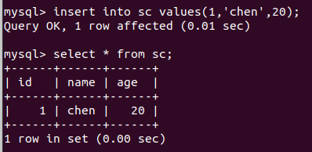

单条插入成功  

然后尝试多条插入  

```sql
insert into sc values(2,'wang',18),(3,'li',19),(4,'zhang',21);
select * from sc;
```

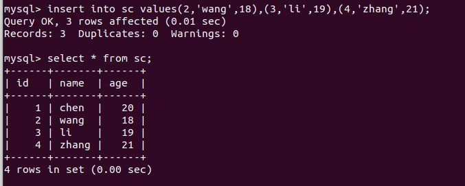

**注：**在测试的时候我尝试过对text类型进行测试，但是发现text类型是会出错的，可能是mysql-5.7.39还没有对text类型完全兼容，具体错误如下：

我们创建一个含有text的数据库sc

```sql
use jxgl;
create table sc(id int,name char(7),age int)engine=dbf;
```

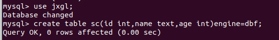

先进行单条插入  

```sql
insert into sc values(1,'chen',20);
select * from sc;
```


此时还没有什么问题，但是再插入一条，会发现先前插入的name会变成对应长度的最后插入的name，如：

```sql
insert into sc values(2,'wang',18),(3,'li',19),(4,'zhang',21);
select * from sc;
```

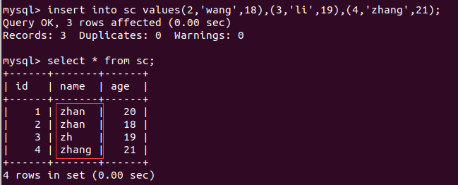

因为这个传进来的内容是mysql来做的而不是引擎，所以我也无法进行修改，但是char类型是不会出错的。综上，目前所实现的引擎对text类型不兼容，只能用char类型。

## 4. 数据更新

首先，我们创建一个表`test`并插入三条数据，通过`select`语句查看表`test`。

```sql
create table test(num int,ch char)engine=dbf;
insert into test values(0,'a'),(1,'b'),(2,'c');
select * from test;
```

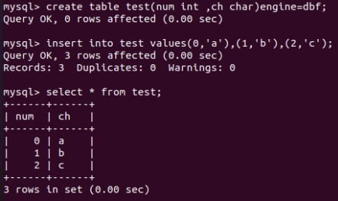


然后我们进行数据更新，将属性num为0的记录属性ch改为'd';

```sql
update test set ch = 'd' where num = 0;
```

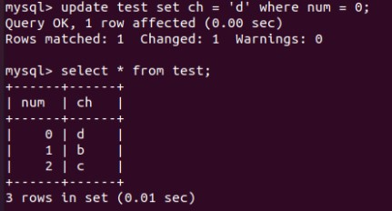

返回1行已更改，通过select 语句查看表，发现更新成功。


然后我们进行“失败”的数据更新测试

```sql
update test set ch = 'd' where num = 3;
```

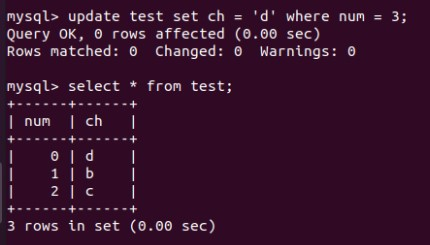

发现数据并未更改，数据更新功能测试结束。


## 5. 数据删除

数据删除的测试和数据更新的流程类似。我们使用同一个表`test`来进行测试。

首先我们删除表中的数据：

```sql
mysql> delete from test where num = 0;
```

返回`Query OK, 1 row affected (0.00 sec)`说明删除成功。

然后我们再删除一个表中不存在的数据：

```sql
mysql> delete from test where num = 3;
```

返回`Query OK, 0 rows affected (0.01 sec)`，说明没有记录被删除。

最后通过select语句查看表。发现测试结果如预期所示。

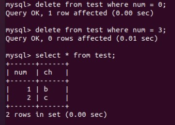

数据删除功能测试结束。


## 6. 表的重命名

先查看一下jxgl里有什么表


我们用2.表的创建中创建的sc表来进行，命令为

```sql
rename table sc to s;
```

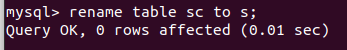

再次查看jxgl数据库，可以发现sc.dbe和sc.frm变成了s.deb和s.frm

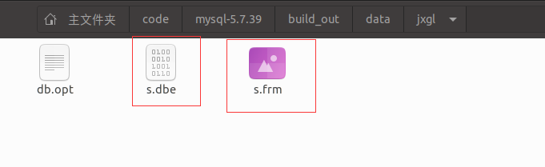

这时候对s表进行操作，也是成功的。

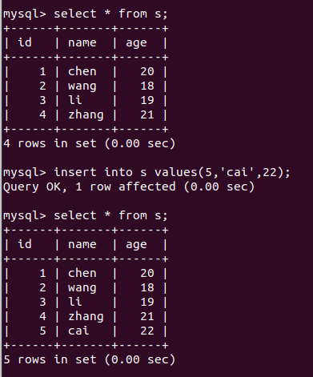

而对sc表进行操作，就会报错  

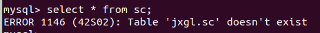

## 7. 表的删除

首先查看jxgl中有什么表  


我们用2.表的创建中创建的sc表来进行，命令为

```sql
drop table sc;
```

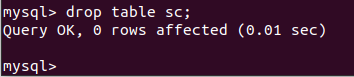

这时候再去查看jxgl，会发现原先创建的sc.deb和sc.frm已经不见了

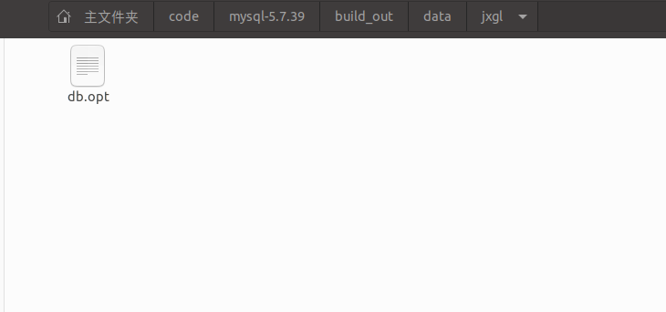

删除成功。

接下来再对sc表进行操作，就会报错  


# 五. 总结

+ ## 心得体会：

  MySQL 是支持动态可插拔的储存引擎体系架构，从而可以创建新的储存引擎并直接将其添加到正在运行的 MySQL 中，而无需重新编译 MySQL。这种架构使得为 MySQL 开发新的储存引擎和部署变得更加容易。

  储存引擎在 MySQL 中的作用主要是进行数据的存储和管理。

  MySQL 服务器通过一系列的 `API` 来与储存引擎交互。

  储存引擎都有一个类定义，并且都继承于一个特殊的接口类 `handler`，`handler` 类上定义了一系列表 `table` 的接口：

  - `create` 创建表；
  - `open` 打开表；
  - `delete_table` 删除表；
  - `write_row` 插入记录；
  - `delete_row` 删除记录；
  - `update_row` 更新记录
  - ……
  - 等等

  实现自定义的储存引擎，需要一一实现这些接口，这些接口就是 SQL 层与储存引擎交互的 `API`。

  而我们小组本次的工作，就是创建了`dbf`存储引擎，实现了这些接口，从而实现了表的创建、数据查询、数据删除、数据更新、表重命名和表删除等六个功能。回顾本次期末大作业，我们小组遇到最大的困难并不是编写代码，而是在环境的搭建上。在项目进行过程中我们小组遇到了很多奇怪的BUG，由于自定义MySQL存储引擎的相关工作较少，遇到了问题也无从参考，只能一点一点调试，寻找问题所在；中间还遇到了小组人员变更的情况，一度想要放弃这个课题。不过我们最终还是克服了困难，实现了一个功能较为完善的MySQL存储引擎`dbf`。

  通过本次期末实验，我们不仅锻炼了我们的实践动手能力，还加强了数据库系统原理的理论知识。非常感谢老师和助教给我们这样一次学习的机会，让我们收获满满，同时也感谢老师和助教这一个学期的认真教导。


+ ## 未来工作：

  1. 实现索引功能
  2. 实现事务功能


# 六. 参考资料

参考教材：[深入理解MySQL]()

环境搭建参考：[使用MySQL源码搭建Debug环境](https://www.bilibili.com/video/BV1YZ4y1b7k5/)


# 七.项目地址

[JP011222/MySQL (github.com)](https://github.com/JP011222/MySQL)

